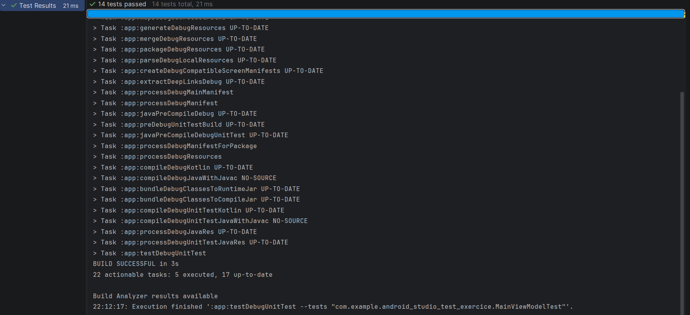
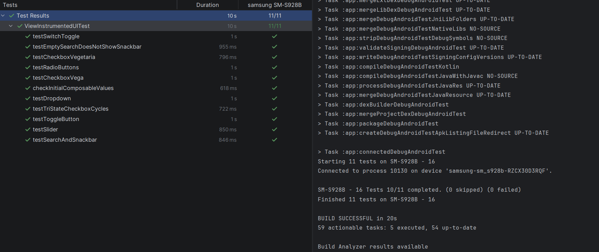

# Proyecto de Testing en Android - Alexandra Sofronie

Este proyecto consiste en una aplicación de Android desarrollada con **Jetpack Compose** orientada a la práctica de **Testing**, tanto unitario como instrumentado. La aplicación muestra diversos componentes de interfaz (interactivos) cuya lógica es gestionada por un `ViewModel`.

## 🧪 Estrategia de Testing

El proyecto se divide en dos grandes bloques de pruebas para asegurar el correcto funcionamiento de la aplicación:

### 1. Unit Testing (Pruebas Unitarias)
Se han diseñado tests para **todos los métodos** del `MainViewModel`. Estas pruebas verifican la lógica de negocio de forma aislada sin necesidad de un dispositivo físico.

- **Ubicación:** `app/src/test/java/.../MainViewModelTest.kt`
- **Cobertura:** 
  - Inicialización de estados.
  - Toggles (Switch, Checkboxes, TriState).
  - Actualización de Sliders, Dropdowns y TextFields.
  - Lógica de validación de búsqueda.

**Resultado de los Unit Tests:**

### 2. Instrumental UI Testing (Pruebas de Interfaz)
Se han diseñado tests para **todos los componentes (Composables)** de la `MainView`. Estas pruebas se ejecutan en un dispositivo o emulador para validar la interacción real del usuario.

- **Ubicación:** `app/src/androidTest/java/.../ViewInstrumentedTest.kt`
- **Cobertura:**
  - Clicks en Switches y Checkboxes.
  - Selección de RadioButtons.
  - Interacción con DropdownMenu y Slider.
  - Entrada de texto y verificación de visibilidad de elementos.

**Resultado de los Instrumental Tests:**

**Vídeo Demostración** : <a href="https://1drv.ms/v/c/6f101936c2c0b671/IQCK6ZqgnnFNSYG5fEaNeNO6AbVeui1pSKtxJWpD45YGg4E?e=jSNRhQ"> Click aquí para ver el vídeo </a>

## 📁 Estructura del Proyecto
- `app/src/main/java/.../viewmodel/MainViewModel.kt`: Contiene toda la lógica y estados.
- `app/src/main/java/.../view/MainView.kt`: Interfaz de usuario con etiquetas `testTag`.
- `app/src/test/`: Pruebas unitarias de lógica.
- `app/src/androidTest/`: Pruebas de integración e interfaz.
